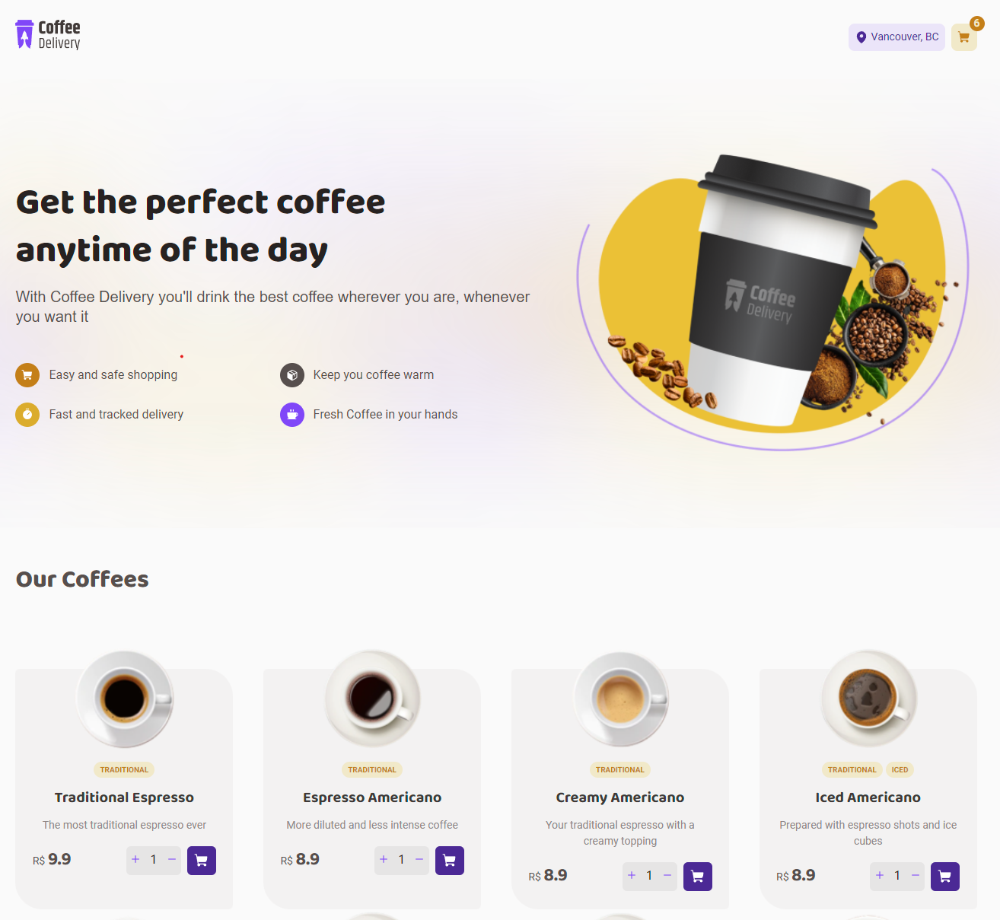

<p align="center">
  
</p>

<p align="center">
    <strong>ToDo List Web Application.</strong>
</p>

<p align="center">
  
  
  
  
</p>

<p align="center">
 <a href="#-About">About</a> •
 <a href="#-Functionalities">Functionalities</a> • 
 <a href="#-layout">Layout</a> • 
 <a href="#-Technologies">Technologies</a> • 
 <a href="#-Installation">Installation</a> • 
</p>

## 💻 About

Small React + TypeScript Application to simulate an Online Coffee Shop

<p align="center">
  
</p>


## ☑ Functionalities

- [x] Add items to cart
- [x] Visit and edit Cart
- [x] Add customer information
- [x] Check order status
- [x] Responsiveness for Mobile Devices

## 🎨 Layout

### Figma File

[Figma Mock](https://www.figma.com/file/5yT9ZzZmRQRS4yivGGB3pl/Coffee-Delivery/duplicate)

## 🔨 Technologies

The following framworks/libraries were used for this project:

- **[ReactJS](https://reactjs.org/)**
- **[TypeScript](https://www.typescriptlang.org/)**
- **[Sass](https://sass-lang.com/)**
- **[Vite](https://vitejs.dev/)**

> Check the full [package.json](https://github.com/flavioccf/coffee_delivery_react/blob/main/package.json)


## 🚀 Installation

```bash
# Clone the repo
git clone https://github.com/flavioccf/coffee_delivery_react.git

# Access the project
cd coffee_delivery_react

# Install dependencies
npm install

# Run the application
npm run dev

# The server will start - port:3000 - acesse http://localhost:3000
```